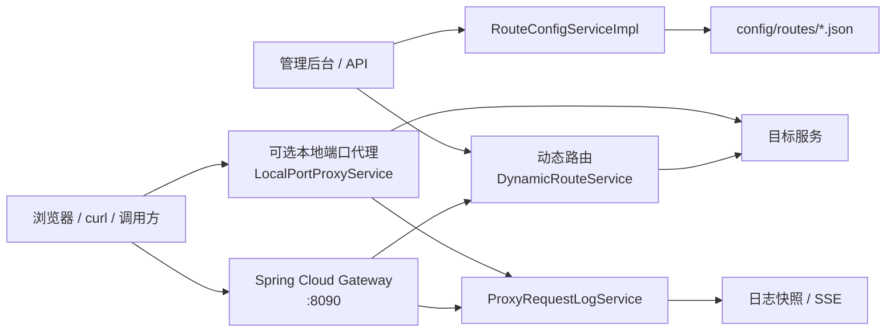

# web-router

`web-router` 是一个轻量 Web 路由代理，用于在本机快速维护多组路径转发规则，并在不重启应用的情况下动态刷新代理配置。项目基于 Spring Boot 3.5、Spring Cloud Gateway、Reactor Netty 和 Thymeleaf 构建，适合开发、联调、测试环境中管理多个后端服务入口。

## 项目定位

在多服务联调场景中，经常需要把不同路径前缀转发到不同目标服务，或临时为某个服务暴露一个独立本地端口。`web-router` 将这些规则保存为本地 JSON 文件，并提供管理后台/API 完成配置的增删改查和实时刷新。

它重点解决：

- 多个后端服务入口分散、切换成本高。
- 路由配置修改后需要重启代理服务。
- 单个目标服务需要独立本地监听地址或端口。
- 缺少对代理请求量、访问 IP、最近请求记录的轻量观测。

## 核心能力

- **路径前缀转发**：按一个或多个 `pathPrefixes` 匹配请求并转发到目标服务。
- **动态 Gateway 路由**：启用配置后自动注册 Spring Cloud Gateway 路由，写操作后即时刷新。
- **独立本地端口代理**：单条路由可选监听独立 `localIp:localPort`，由 Reactor Netty 转发请求。
- **本地 JSON 持久化**：每条路由保存为 `config/routes/<id>.json`，无需数据库。
- **管理后台**：通过 Thymeleaf 页面管理路由配置、查看原始 JSON、复制访问地址。
- **请求日志统计**：记录总请求数、去重 IP、按 IP 聚合、最近请求日志，并支持 SSE 实时推送。
- **旧配置兼容**：保留 `pathPrefix` 单路径字段，并与 `pathPrefixes[0]` 同步。

## 技术栈

| 类型 | 技术 |
| --- | --- |
| 运行框架 | Spring Boot 3.5.2 |
| 路由代理 | Spring Cloud Gateway 2024.0.1 |
| 本地端口代理 | Reactor Netty |
| 页面模板 | Thymeleaf |
| 配置存储 | 本地 JSON 文件 |
| 构建工具 | Maven |
| Java 版本 | JDK 21 |

## 架构概览



## 关键模块

- `src/main/java/com/geek/webrouter/Application.java`：应用入口。
- `src/main/java/com/geek/webrouter/config/DynamicRouteService.java`：动态 Gateway 路由注册与刷新。
- `src/main/java/com/geek/webrouter/config/LocalPortProxyService.java`：单路由独立本地端口代理。
- `src/main/java/com/geek/webrouter/web/service/impl/RouteConfigServiceImpl.java`：路由配置文件读写、校验和冲突检测。
- `src/main/java/com/geek/webrouter/web/controller/RouteConfigController.java`：管理页面和路由配置 API。
- `src/main/java/com/geek/webrouter/web/controller/ProxyRequestLogController.java`：请求日志快照和 SSE API。
- `src/main/resources/templates/index.html`：管理后台页面。
- `src/main/resources/static/js/app.js`、`src/main/resources/static/css/style.css`：管理后台交互和样式。

## 使用说明

详细的启动、配置、转发规则和 API 示例请查看：[USAGE.md](./USAGE.md)。

## 开发与验证

```bash
mvn test
mvn spring-boot:run
```

默认监听地址：`127.0.0.1:8090`。

启动后访问：

- 管理后台：<http://localhost:8090/admin>
- 健康检查：<http://localhost:8090/actuator/health>

## 许可证

当前仓库未声明许可证。如需对外发布，请先补充明确的 LICENSE 文件。
