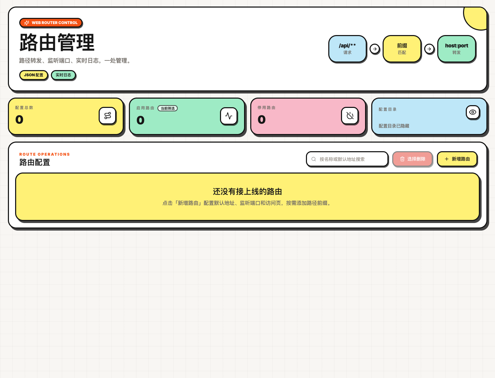
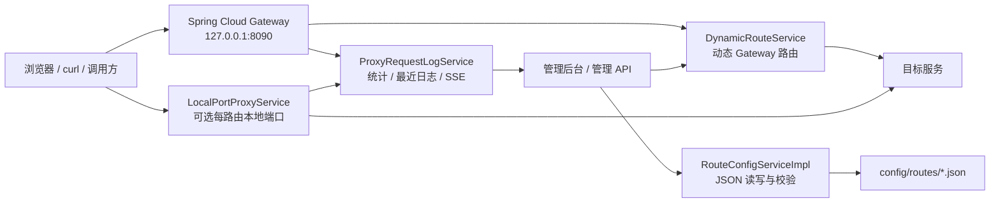

# web-router

<p align="center">
  
</p>

<p align="center">
  <a href="https://spring.io/projects/spring-boot"></a>
  <a href="https://spring.io/projects/spring-cloud-gateway"></a>
  
  
  
  
  
</p>

<p align="center">
  <a href="#快速启动">快速启动</a> ·
  <a href="#功能总览">功能总览</a> ·
  <a href="./USAGE.md">使用说明</a> ·
  <a href="./wiki/Home.md">Wiki 文档</a>
</p>

`web-router` 是一个面向本地开发、联调和测试环境的轻量 Web 路由代理。它把多组路径转发规则保存为本地 JSON 文件，并通过 Spring Cloud Gateway、Reactor Netty 和 Thymeleaf 管理后台实现“配置即改即生效”。

## 功能总览

| 功能 | 当前行为 |
| --- | --- |
| 管理后台 | `GET /admin` 打开 Thymeleaf 管理页面；`GET /` 自动重定向到 `/admin`。 |
| 路由配置 | 每条路由保存为 `config/routes/<id>.json`，创建时自动生成 `route-yyyyMMddHHmmss-xxxxxx` 形式 ID。 |
| 多路径前缀 | 一条路由支持多个 `pathPrefixes`；旧字段 `pathPrefix` 会与第一项保持同步。 |
| Gateway 转发 | 启用路由按每个路径前缀注册 Gateway 路由，并按层级执行 `StripPrefix`。 |
| 独立本地端口代理 | 启用且配置了 `localPort` 的路由会启动独立 `localIp:localPort` 监听。 |
| 本地代理入口隔离 | 本地端口代理只接受命中该路由 `pathPrefixes` 的请求，且保留原始 URI 转发。 |
| 动态刷新 | 新增、更新、删除路由后即时刷新 Gateway 路由和本地端口代理，无需重启。 |
| 请求观测 | Gateway 与本地端口代理都会记录请求统计、最近日志，并支持 SSE 实时推送。 |
| 统一响应 | 管理 API 统一返回 `Result<T>`；业务/校验错误通常为 HTTP 200 + `success=false`。 |
| 打包发布 | `scripts/build-dist.sh` 可生成包含 JAR、Linux/macOS 与 Windows 启停脚本、后台配置文件、路由配置目录和文档的 `target/*.tar.gz`，并同步复制到 `target/dist/`。 |

## 技术栈

| 类型 | 技术 |
| --- | --- |
| 运行框架 | Spring Boot 3.5.2 |
| 路由代理 | Spring Cloud Gateway 2024.0.1 |
| 本地代理 | Reactor Netty |
| 页面模板 | Thymeleaf |
| 配置存储 | 本地 JSON 文件 |
| 构建工具 | Maven |
| Java 版本 | JDK 21 |

## 架构概览



## 快速启动

```bash
mvn test
mvn spring-boot:run
```

默认监听：`127.0.0.1:8090`。

启动后访问：

- 管理后台：<http://localhost:8090/admin>
- 健康检查：<http://localhost:8090/actuator/health>
- 应用信息：<http://localhost:8090/actuator/info>

## 最小路由示例

```json
{
  "name": "测试服务",
  "pathPrefixes": ["/test", "/api/test"],
  "targetUrl": "localhost:8081",
  "localIp": "127.0.0.1",
  "localPort": 18081,
  "enabled": true
}
```

保存后：

- Gateway：`http://localhost:8090/test/hello` -> `http://localhost:8081/hello`
- 本地端口代理：`http://127.0.0.1:18081/test/hello` -> `http://localhost:8081/test/hello`

> 差异点：Gateway 会剥离匹配前缀；本地端口代理只做入口隔离，不剥离前缀。

## 文档入口

- [使用说明](./USAGE.md)：启动、配置、API、打包和排障。
- [变更说明](./CHANGELOG.md)：当前版本能力清单。
- [Wiki 首页](./wiki/Home.md)：适合发布到 GitHub Wiki 的分章节文档。

## 开发与验证

```bash
mvn test
mvn spring-boot:run
scripts/build-dist.sh --with-tests
```

当前前端资源直接位于 `src/main/resources/templates` 和 `src/main/resources/static`，没有 npm 构建流程。

## 许可证

当前仓库未声明许可证。如需对外发布，请先补充明确的 LICENSE 文件。
