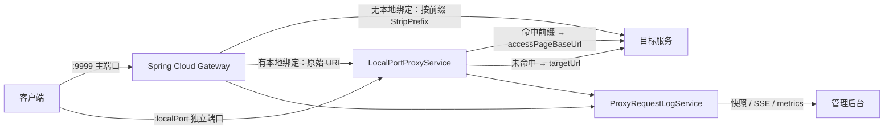

# wrouter 核心功能

本文是 **wrouter 能力的权威说明**，以当前代码为准。

---

## 1. 定位与运行时组成

用本地 JSON 文件维护多组路径转发规则，写入即时生效（无需重启），并提供控制台观察每条路由的流量与日志。

| 组件 | 实现 | 职责 |
| --- | --- | --- |
| 管理后台 | React 19 + Vite + Tailwind（`frontend/` → `src/main/resources/static/admin/`） | 路由管理、拓扑、日志、指标、主题与视图切换 |
| 页面挂载 | Thymeleaf（`templates/index.html`） | 输出 `#root`、注入配置目录、挂载静态资源 |
| 主网关 | Spring Cloud Gateway（Reactor Netty） | 按 Path 谓词转发主端口流量 |
| 本地端口代理 | Reactor Netty `HttpServer` + `HttpClient` | 为单条路由提供独立 `localIp:localPort` 入口 |
| 配置存储 | 本地 JSON（`config/routes/<id>.json`） | 唯一持久化介质，无数据库 |
| 请求观测 | 内存统计 + SSE | 统计、最近日志、滚动流量指标 |

### 请求链路



> **一条路由是否配置 `localPort`，会改变 Gateway 的转发方式**，见 §4.3 与 §5.3。

### 启动顺序

1. `RouteConfigServiceImpl` 创建 `config/routes`。
2. `DynamicRouteService.init()` 调用 `refreshAll()`：读全部 `enabled=true` 配置 → 差量注册 Gateway 路由 → 刷新本地端口代理 → 发布 `RefreshRoutesEvent`。
3. Netty 在 `server.port`（默认 **9999**）启动。

启动刷新失败只记日志，不阻止启动。

---

## 2. 数据模型与存储

### RouteConfig 字段

| 字段 | 必填 | 说明 |
| --- | --- | --- |
| `id` | 系统生成 | 路由 ID，同时是配置文件名与 Gateway routeId 基础值，格式 `route-yyyyMMddHHmmss-xxxxxx` |
| `name` | 是 | 展示名，≤50 字，全局唯一 |
| `pathPrefix` | 否 | 兼容旧配置的单路径字段，写回时与 `pathPrefixes[0]` 同步 |
| `pathPrefixes` | 否 | 路径前缀列表；同路由内不可重复，不同路由可复用 |
| `targetUrl` | 是 | 默认地址（兜底），保存前归一化为带协议 URL |
| `accessPageBaseUrl` | 配前缀时必填 | 代理地址，**只被本地端口代理消费** |
| `accessPage` | 否 | 访问页，后台「访问」按钮优先打开 |
| `localIp` | 否 | 本地监听 IP，默认 `127.0.0.1` |
| `localPort` | 管理 API 必填 | 本地监听端口，1–65535 |
| `enabled` | 否 | 停用后保留文件，但不注册路由、不启动本地代理 |

### 存储规则

- 一条路由一个文件：`<home>/config/routes/<id>.json`，写入使用 Jackson 美化输出。
- `listAll()` 按文件最后修改时间**倒序**返回。
- `resolveFilePath()` 校验 `^[a-zA-Z0-9_-]+$`，**阻断路径穿越**，外部传入的 routeId 必须经它。
- 写操作在 `synchronized (fileMonitor)` 内串行；更新时若可编辑内容未变，会恢复原 mtime，避免列表顺序跳动。

### 应用根目录

解析顺序：系统属性 `wrouter.home` → 环境变量 `WROUTER_HOME` → 当前工作目录 `user.dir`。

| 路径 | 用途 |
| --- | --- |
| `<home>/config/application.yml` | 外部配置 |
| `<home>/config/routes/` | 路由配置 |
| `<home>/updates/` | 自动更新工作目录（下载、备份、更新脚本、update.log） |

---

## 3. 路由配置管理

实现：`RouteConfigServiceImpl` + `RouteConfigController`。

### 写操作流程

| 操作 | 步骤 |
| --- | --- |
| 创建 | 归一化 → 校验 → 生成 ID → 查重（名称 / 本地绑定）→ 写文件 |
| 更新 | 读现状 → 归一化 → 校验 → 查重（排除自身）→ 写文件 |
| 删除 | 不存在则 `NOT_FOUND` |
| 导入 | 逐个归一化与校验（含批次内查重）→ 生成新 ID 写文件 → 失败**回滚已写文件** |

ID 生成：`route-` + `yyyyMMddHHmmss` + `-` + UUID 前 6 位，最多重试 5 次。

### 归一化

| 字段 | 处理 |
| --- | --- |
| `targetUrl` / `accessPageBaseUrl` | 缺协议时补 `http://` |
| `pathPrefixes` | trim、去尾部 `/`（根路径保留）、同路由去重 |
| `localIp` | 配端口时为空填 `127.0.0.1`；无端口时为空置 `null` |
| `accessPage` / `accessPageBaseUrl` | 空白归一化为 `null` |

### 导入 / 导出

- 导出：`GET /admin/api/routes/export` → `{version, exportedAt, routes}`；前端下载为 `wrouter-routes-<UTC 时间戳>.json`。
- 导入：`POST /admin/api/routes/import`，接受带 `version` 的对象或裸数组。**总是新增**（重新生成 ID），不覆盖同名路由；批次内名称或启用绑定重复则整体拒绝。
- 两者完成后立即刷新 Gateway 与本地代理。

---

## 4. Gateway 动态转发

实现：`DynamicRouteService`。

### 刷新机制

```text
refreshAll()
  ├─ 获取信号量（同一时刻只允许一次刷新）
  ├─ desiredRoutes = 所有 enabled 配置 × 每个路径前缀
  ├─ 差量：idsToRemove / specsToSave
  ├─ 顺序删除 → 顺序保存
  ├─ localPortProxyService.refreshAll(enabledConfigs)
  └─ 替换内存快照 + 发布 RefreshRoutesEvent
```

- **差量更新**：内容未变的 routeId 不会被删除重建，避免刷新瞬间 404。
- 刷新在 `boundedElastic` 执行，不阻塞事件循环。
- 所有写操作持久化后都会调用 `refreshAll()`，因此**改完即生效**。

### 注册规则

| 项 | 规则 |
| --- | --- |
| routeId | 第 1 个前缀用基础 `id`，后续用 `<id>__<index>` |
| Path 谓词 | `/` → `/**`；`/test` → `/test,/test/**` |
| StripPrefix | 按层级：`/test/api` 剥 2 段，`/` 不剥 |
| order | 固定 0 |

### 4.3 本地绑定会改写 Gateway 目标

| 是否配置 `localPort` | Gateway uri | StripPrefix | 结果 |
| --- | --- | --- | --- |
| 否 | `targetUrl` | 按层级剥离 | 直接转发，路径已去前缀 |
| 是 | `http://<localIp>:<localPort>` | **0** | 原样交给本地代理，由它决定最终上游 |

> **`accessPageBaseUrl` 只影响本地端口代理，不影响 Gateway 目标。**
> 前缀为空时不注册任何 Gateway 路由，该路由只能通过本地端口访问。

---

## 5. 每路由本地端口代理

实现：`LocalPortProxyService`。为单条路由提供独立监听端口，是本项目区别于普通反向代理的核心能力。

| 时机 | 行为 |
| --- | --- |
| 启用且有 `localPort` | 启动监听 `effectiveLocalIp():localPort` |
| 配置变化但绑定不变 | **原地更新**配置引用，不重启端口 |
| 绑定新增 / 消失 | 启动新监听 / 停止并释放 |
| 应用关闭 | `@PreDestroy` 逐个释放 |

以 `localIp:localPort` 为键维护监听表，并用版本号跳过过期刷新；同一绑定被两条启用路由占用时抛 `DUPLICATE_LOCAL_BINDING`。

### 上游选择与 URI 语义

命中该路由任一前缀且配置了代理地址 → 走 `accessPageBaseUrl`；否则走 `targetUrl`。
**不剥离前缀**：把原始请求 URI（含 query）追加到上游地址后。

| 配置 | 请求 | 上游收到 |
| --- | --- | --- |
| 前缀 `/test`，代理 `http://localhost:8082` | `127.0.0.1:18081/test/hello?a=1` | `http://localhost:8082/test/hello?a=1` |
| 同上，默认 `http://localhost:8081` | `127.0.0.1:18081/other` | `http://localhost:8081/other` |

与 Gateway 的差异（Gateway 会 StripPrefix）是**设计差异**，不是缺陷。

### 请求 / 响应处理

| 项 | 行为 |
| --- | --- |
| 方法 / 请求体 | 透传 |
| 请求头 | 透传，过滤 hop-by-hop 头与 `Connection` 中列出的头 |
| `Host` | 改写为上游 `host[:port]` |
| 响应缓存 | 强制 `Connection: close`、`Cache-Control: no-store...`、`Pragma: no-cache`、`Expires: 0` |
| 上游失败 | **HTTP 502** + 文本 `Proxy request failed`，并记一条 502 日志 |
| 报文采样 | 请求/响应体各最多 4096 字符，超出追加 `[已截断]` |

客户端 IP：优先 `X-Forwarded-For` 首段，回环统一记为 `127.0.0.1`。

---

## 6. 请求观测与流量指标

实现：`ProxyRequestLogFilter`（Gateway 侧）、`LocalPortProxyService`（本地端口侧）、`ProxyRequestLogService`（聚合）、`ProxyRequestLogController`（API）。

两条采集路径都写入同一个服务，因此口径一致。注意：同时配置 `localPort` 的路由，一次客户端请求可能产生**两条日志**。

### 统计口径

| 指标 | 口径 |
| --- | --- |
| `totalRequests` | 累计请求数 |
| `failedRequests` | `status >= 400` 累计 |
| `slowRequests` | 耗时 ≥ 1000ms 累计 |
| `averageDurationMs` | `totalDurationMs / totalRequests` |
| `recentLogs` / `durationTopLogs` | 各 100 条 |
| `pathStats` 等 | 按路径的请求数 / 累计耗时 / 最大耗时 |

最近日志与耗时 Top 都只保留最近 **100** 条（
`ProxyRequestLogService.MAX_RECENT_LOGS = 100`），更早的明细会被淘汰。

失败与慢请求是**全量累计**，不受最近 100 条窗口限制。

### 滚动窗口

`TimeBucketRing` = 固定桶数时间环（`long[] counts` + 惰性清零的 `stamps`）：

| Ring | 桶宽 | 桶数 | 产出 |
| --- | --- | --- | --- |
| minute | 1 秒 | 60 | `requestsLastMinute` / `failedLastMinute` |
| traffic | 60 秒 | 30 | `trafficBuckets`（由旧到新，长度恒为 30） |

全局与每条路由各一组。派生 ID（`<id>__<n>`）归并到基础 ID。未知路由返回 30 个 0。

### 实时推送

`GET /admin/api/proxy-logs/stream` 与 `.../routes/{routeId}/stream`，事件名 `proxy-request`。

### 紧凑指标接口

`GET /admin/api/proxy-logs/metrics` → `Map<routeId, RouteTrafficMetrics>`，字段：
`routeId`、`totalRequests`、`failedRequests`、`slowRequests`、`totalDurationMs`、
`requestsLastMinute`、`failedLastMinute`、`averageDurationMs`、`trafficBuckets`。
未产生过请求的路由不出现在结果中。列表页用它一次拉全，避免逐卡请求日志明细。

---

## 7. 版本与自动更新

### 构建元信息

Maven 资源过滤把构建信息注入 classpath 的 `version.properties`：

```properties
app.version=1.3.0
app.buildTime=2026-09-30T15:56:37Z
app.platform=macos-arm64          # 可用 -Dwrouter.platform=... 覆盖
app.installMode=app-image         # jar | app-image | installer
app.updateChannel=stable
app.repository=geek-xin/web-router
```

资源缺失时全部降级为安全默认（`version=unknown`、`installMode=jar` 等），接口不报错。

### 接口

| 接口 | 行为 |
| --- | --- |
| `GET /admin/api/version` | 当前版本、构建时间、平台、安装形态、是否支持自更新、通道、仓库 |
| `GET /admin/api/update/check` | 查 GitHub Release、比对版本、按安装形态与平台选包；**永远返回 success=true**，异常写进 `message` |
| `POST /admin/api/update/apply` | 下载资产 → 校验 sha256 → 生成平台更新脚本 → 应用约 2 秒后退出，由脚本替换并重启 |

选包规则（与 `ReleaseAssets`、打包脚本三方一致）：

| installMode | 资产 |
| --- | --- |
| `jar` | `wrouter-<version>-jar.zip` |
| `app-image` | `wrouter-<version>-<platform>-app.zip`（Linux 为 `.tar.gz`） |

更新脚本（`<home>/updates/apply-update.sh|.bat`）：等旧进程退出 → 备份 → 解压替换 → 重启；
任一步失败回滚，过程写入 `updates/update.log`，可重复执行。

> 环境变量 `WROUTER_GITHUB_TOKEN` 可选，用于提高 GitHub API 速率限制。

---

## 8. 管理后台

源码 `frontend/src/**`；视觉规范见 [UI 设计系统](UI-DESIGN-SYSTEM.md)。

### 数据来源

| 界面数据 | 来源 | 刷新 |
| --- | --- | --- |
| 路由列表 | `GET /admin/api/routes` | 载入 + 写操作后 |
| 卡片指标 | `GET /admin/api/proxy-logs/metrics` | 载入 + 每 5 秒 |
| 网关状态 | `GET /actuator/health` | 载入 |
| 详情抽屉 | `/routes/{id}/raw`、`/proxy-logs/routes/{id}` | 打开时 |
| 版本与更新 | `/admin/api/version`、`/update/check` | 打开版本抽屉时 |

### 核心界面

- **KPI 行**：路由总数 / 运行中 / 已停用 / 请求数·分钟 / 平均延迟，前三项点击即筛选。
- **工具栏**：搜索（名称 / Path / Target / 监听地址 / id）、状态筛选、排序（最近创建 / 名称 / 流量 / 延迟）、**卡片·列表切换**、导出、导入、新增。
- **两种展示形式**（可切换，选择会被记住）：
  - **卡片视图**（默认）：每卡含状态、Path 标签、Target、本地端口、请求数·分钟、平均延迟、30 分钟 Sparkline。
  - **列表视图**：同样字段压成一行，带列头，适合一次浏览大量路由。
- **详情抽屉**：① 路由拓扑 ② 基本信息 ③ 运行状态 ④ 最近日志，另有配置 / 日志 / 指标标签页。
- **日志视图**：实时流、Top 路径、单耗时 Top、诊断分析。

### 主题

- **深色 / 浅色可切换**，默认跟随操作系统 `prefers-color-scheme`；用户显式切换后写入 `localStorage`，此后不再跟随系统。
- 实现方式：`<html data-theme="light|dark">` 切换 CSS 变量集合，Tailwind 调色板同样指向这些变量。
- 存储键：主题 `wrouter.theme`、视图 `wrouter.routeView`。

### 状态判定

| 状态 | 判定 |
| --- | --- |
| 运行中 | `enabled` 且失败率 ≤ 5% |
| 已停用 | `!enabled` |
| 异常 | `enabled` 且失败率 > 5% |
| 错误 | `enabled` 且失败率 ≥ 20% |

失败率优先用最近 60 秒口径（`failedLastMinute / requestsLastMinute`），窗口内无请求时退回累计口径。

### 降级

- `/metrics` 不可用 → 指标显示 `—`，Sparkline 为水平基线，不报错。
- `/version` 不可用 → 使用前端兜底常量，界面其余部分照常。
- 网关健康检查失败 → 顶栏显示未响应。

---

## 9. 管理 API 参考

所有接口统一返回 `Result<T>`。

### 页面

| 方法 | 路径 | 说明 |
| --- | --- | --- |
| GET | `/` | 302 → `/admin` |
| GET | `/admin` | 管理后台 |

### 路由配置

| 方法 | 路径 | 说明 |
| --- | --- | --- |
| GET | `/admin/api/routes` | 全部路由（按 mtime 倒序） |
| GET | `/admin/api/routes/{routeId}` | 单条路由 |
| GET | `/admin/api/routes/{routeId}/raw` | 原始 JSON（`fileName` + `content`） |
| GET | `/admin/api/routes/export` | 导出 |
| POST | `/admin/api/routes/import` | 批量导入（总是新增） |
| POST | `/admin/api/routes` | 创建（成功后刷新） |
| PUT | `/admin/api/routes/{routeId}` | 更新（成功后刷新） |
| DELETE | `/admin/api/routes/{routeId}` | 删除（成功后刷新） |

### 日志与指标

| 方法 | 路径 | 说明 |
| --- | --- | --- |
| GET | `/admin/api/proxy-logs` | 全部路由快照 |
| GET | `/admin/api/proxy-logs/metrics` | 全部路由紧凑指标 |
| GET | `/admin/api/proxy-logs/routes/{routeId}` | 指定路由快照 |
| GET | `/admin/api/proxy-logs/stream` | 全部路由 SSE |
| GET | `/admin/api/proxy-logs/routes/{routeId}/stream` | 指定路由 SSE |

### 版本与更新

| 方法 | 路径 |
| --- | --- |
| GET | `/admin/api/version` |
| GET | `/admin/api/update/check` |
| POST | `/admin/api/update/apply` |

### 运维

| 方法 | 路径 |
| --- | --- |
| GET | `/actuator/health`、`/actuator/info` |

---

## 10. 校验规则与错误语义

### 校验矩阵

| 对象 | 规则 |
| --- | --- |
| `id` | `^[a-zA-Z0-9_-]+$` |
| `name` | 非空、≤50 字、全局唯一 |
| `pathPrefixes` | 每项 `^/[-a-zA-Z0-9_/]*$`；同路由内不重复 |
| `targetUrl` | `^(https?://)?[-a-zA-Z0-9.]+:\d{1,5}$` |
| `accessPageBaseUrl` | 同上；**配置前缀时必填** |
| `localIp` | 空 / `localhost` / 合法 IPv4 |
| `localPort` | 1–65535 |
| 本地绑定唯一性 | 启用且配置端口的路由之间不可重复 |

路径前缀冲突只判断「完全相同」，不做父子包含判断。

### 错误码

| 错误码 | 值 | 含义 |
| --- | --- | --- |
| `SUCCESS` | 200 | 操作成功 |
| `BAD_REQUEST` | 400 | 请求参数错误 |
| `NOT_FOUND` | 404 | 资源不存在 |
| `DUPLICATE_NAME` | 409 | 路由名称已存在 |
| `DUPLICATE_PREFIX` | 409 | 路径前缀重复 |
| `DUPLICATE_LOCAL_BINDING` | 409 | 本地监听地址已存在 |
| `INTERNAL_ERROR` | 500 | 服务器内部错误 |
| `CONFIG_IO_ERROR` | 500 | 配置文件读写失败 |

### HTTP 语义

| 场景 | HTTP | 响应体 |
| --- | --- | --- |
| 成功 | 200 | `success=true, code=200, data` |
| 业务异常 | **200** | `success=false, code=<业务码>, message` |
| 参数校验失败 | **200** | `success=false, code=400` |
| 未捕获异常 | 500 | `success=false, code=500` |
| 本地端口代理上游失败 | 502 | 文本 `Proxy request failed`（非 `Result`） |

> 前端 `fetchJson()` 依赖「业务错误 HTTP 200 + `success=false`」，改异常语义必须同步前端。

---

## 11. 配置与运行时

`src/main/resources/application.yml`：

| 配置 | 值 |
| --- | --- |
| `server.address` / `server.port` | `127.0.0.1` / `9999` |
| `spring.thymeleaf.cache` | `false` |
| `spring.cloud.gateway.httpclient.connect-timeout` | `5000` |
| `spring.cloud.gateway.httpclient.response-timeout` | `30s` |
| `management.endpoints.web.exposure.include` | `health,info` |

前端顶栏展示的地址来自 `frontend/src/lib/app-meta.ts` 的 `GATEWAY_ENDPOINT`，改端口时必须同步。

---

## 12. 关键不变量

1. 配置文件名 = 路由 ID；外部 routeId 一律经 `resolveFilePath()` 校验。
2. 创建 / 更新 / 删除 / 导入之后必须调用 `refreshAll()`。
3. 派生 routeId `<id>__<n>` 在日志、SSE、指标中都要归并到基础 `id`。
4. 改统计逻辑时同时检查 `ProxyRequestLogFilter` 与 `LocalPortProxyService`。
5. 写回 JSON 时保持 `pathPrefix` 与 `pathPrefixes[0]` 同步。
6. 业务错误保持 HTTP 200 + `success=false`。
7. `localPort` 存在时 Gateway 目标改写为本地监听且不剥离前缀；`accessPageBaseUrl` 只被本地代理消费。
8. 新增路由字段需同步：`RouteConfig` → `RouteConfigDto` → `RouteConfigServiceImpl` → 前端表单/列表/复制/JSON 预览 → 重新 `npm run build`。
9. 新增 UI 能力需同步 `UI-DESIGN-SYSTEM.md` 与 `UI-IMPLEMENTATION.md`，`AdminUiContractTest` 会校验。
10. 改核心机制需同步本文，`CoreFeaturesDocContractTest` 会校验阈值、接口、错误码与文档互链。

---

## 13. 验证

```bash
mvn test                                                     # 后端，含两个文档契约测试
cd frontend && npm run typecheck && npm test && npm run build
```

与核心功能直接相关的测试：`RouteConfigServiceImplTest`、`RouteConfigServiceImplImportExportTest`、
`DynamicRouteServiceTest`、`LocalPortProxyServiceTest`、`ProxyRequestLogServiceTest`、
`ProxyRequestLogControllerTest`、`AppVersionControllerTest`、`UpdateServiceTest`、
`AdminUiContractTest`、`CoreFeaturesDocContractTest`。

手工验证清单：

1. 新增路由 → 卡片立即出现，Gateway 与本地端口均已监听。
2. 访问主端口 `/{prefix}/xxx` → 上游收到**剥离前缀后**的路径。
3. 访问 `http://127.0.0.1:{localPort}/{prefix}/xxx` → 上游收到**未剥离**的原始 URI。
4. 访问 `http://127.0.0.1:{localPort}/other` → 走默认地址。
5. 停用路由 → 路由与监听同时消失，卡片降权。
6. 切换深/浅色主题与卡片/列表视图 → 立即生效，刷新后保持。
7. 打开版本抽屉 → 显示版本、构建时间、平台、安装方式，并可检查更新。
8. 指向不存在的上游端口 → 本地端口返回 502，日志记录 502。

---

## 14. 已知边界

| 边界 | 说明 |
| --- | --- |
| 统计为内存态 | 重启后统计与最近日志清空 |
| 滚动窗口是桶级近似 | 跨桶即过期，非毫秒级滑动 |
| `snapshot(routeId)` 不归并 | 前端必须传基础 ID，`<id>__1` 会得到空快照 |
| 报文采样有上限 | 各 4096 字符 |
| 日志窗口有限 | 最近日志与耗时 Top 各 100 条 |
| 双入口重复计数 | 同时配置 `localPort` 的路由一次请求可能记两条日志 |
| 无鉴权 | 仅监听回环地址，不要直接暴露公网 |
| 未签名安装包 | macOS / Windows 首次打开需手动放行，见[打包文档](PACKAGING.md) |

---

## 15. 相关文档

| 文档 | 内容 |
| --- | --- |
| [UI 设计系统](./UI-DESIGN-SYSTEM.md) | 管理后台的视觉与交互契约、验收清单 |
| [UI 实现映射](./UI-IMPLEMENTATION.md) | 设计规范到文件、类名与数据契约的映射 |
| [打包与发布](./PACKAGING.md) | 交付形态、资产命名契约、自动更新与 CI 发布 |
| [使用说明](../USAGE.md) | 启动、配置与日常使用 |
| [Wiki](../wiki/Home.md) | 架构、API 参考与排障 |
