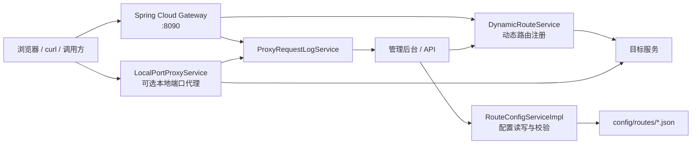

# web-router Wiki

`web-router` 是一个轻量 Web 路由代理，用于在本机维护多组路径转发规则，并在不重启应用的情况下动态刷新代理配置。它适合开发、联调和测试环境中统一管理多个后端服务入口。

## 项目定位

- 用本地 JSON 文件维护路由配置，无需数据库。
- 用 Spring Cloud Gateway 提供主端口路径前缀转发。
- 用 Reactor Netty 为单条路由提供可选独立本地端口代理。
- 用 Thymeleaf 管理后台完成配置管理、日志查看和实时刷新。

## 当前能力

| 能力 | 说明 |
| --- | --- |
| 多路径前缀 | 一条路由可配置多个 `pathPrefixes`，旧字段 `pathPrefix` 继续兼容。 |
| 动态 Gateway | 写操作后即时刷新 Gateway 路由；多前缀会生成派生 routeId。 |
| 本地端口代理 | 启用且配置 `localPort` 的路由启动独立监听，按当前路由前缀做入口隔离。 |
| 配置校验 | 校验名称、前缀、目标地址、本地 IP/端口和绑定冲突。 |
| 请求日志 | 记录 Gateway 与本地端口代理请求，提供快照、Top 路径、最近日志和 SSE。 |
| 管理后台 | 支持路由 CRUD、原始 JSON 查看、访问地址复制、单路由日志弹窗。 |
| 发布脚本 | `scripts/build-dist.sh` 生成包含 Linux/macOS 与 Windows 启停脚本的可分发 tar.gz 包到 `target/`，并同步复制到 `target/dist/`。 |

## 架构概览

## 快速入口

- 管理后台：`http://localhost:8090/admin`
- 健康检查：`http://localhost:8090/actuator/health`
- 应用信息：`http://localhost:8090/actuator/info`

## 推荐阅读顺序

1. [快速开始](Getting-Started)
2. [用户指南](User-Guide)
3. [架构与机制](Architecture)
4. [API 参考](API-Reference)
5. [常见问题](Troubleshooting)
6. [开发指南](Development-Guide)
