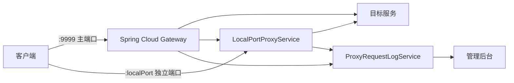

# wrouter Wiki

`wrouter` 是一个轻量 Web 路由代理：把「路径前缀 → 后端服务」的转发规则存成本地 JSON 文件，改完立即生效，无需重启。

当前版本：`1.3.0`。Java 包名仍为 `com.geek.webrouter`（历史保留）。

## 快速入口

| 入口 | 地址 |
| --- | --- |
| 管理后台 | <http://localhost:9999/admin> |
| 健康检查 | <http://localhost:9999/actuator/health> |
| 应用信息 | <http://localhost:9999/actuator/info> |

默认监听 `127.0.0.1:9999`，配置见 `src/main/resources/application.yml`。

## 三种交付形态

| 形态 | 说明 |
| --- | --- |
| 安装包 | macOS `dmg` / Windows `exe` / Linux `deb`、`rpm` |
| 免安装 app-image | 解压即用，内置运行时（`-app.zip` / Linux `-app.tar.gz`） |
| 传统 JAR | `java -jar wrouter-<version>.jar`，需自带 JDK 21 |

三种形态都支持管理后台的**自动更新**，并在版本抽屉展示当前版本号。

构建命令、产物命名与目录结构详见 [打包与发布](../docs/PACKAGING.md)，本文不重复。

## 核心机制

- **本地 JSON 配置**：一条路由一个文件 `config/routes/<id>.json`，无数据库。
- **Gateway 动态转发**：写操作后差量刷新路由；多前缀派生 routeId `<id>__<n>` 并执行 `StripPrefix`。
- **每路由本地端口代理**：可选 `localPort`，独立入口，保留原始 URI。
- **请求观测**：日志快照、SSE 实时流、最近 60 秒滚动请求/失败数与最近 30 分钟序列。

```mermaid
flowchart LR
    C["客户端"] -->|":9999 主端口"| G["Spring Cloud Gateway"]
    C -->|":localPort 独立端口"| L["LocalPortProxyService"]
    G --> T["目标服务"]
    G --> L
    L --> T
    G --> R["ProxyRequestLogService"]
    L --> R
    R --> A["管理后台"]
```

## 阅读顺序

1. [快速开始](Getting-Started)
2. [用户指南](User-Guide)
3. [架构与机制](Architecture)
4. [API 参考](API-Reference)
5. [常见问题](Troubleshooting)

## 权威文档

wiki 只做速查，细节以仓库文档为准：

- [核心功能说明](../docs/CORE-FEATURES.md)：数据模型、转发语义、观测口径、校验规则、关键不变量、已知边界。
- [UI 设计系统](../docs/UI-DESIGN-SYSTEM.md)：管理后台视觉与交互规范。
- [UI 实现映射](../docs/UI-IMPLEMENTATION.md)：规范到文件与数据契约的映射。
- [打包与发布](../docs/PACKAGING.md)：交付形态、构建、自动更新与 CI 发布。
